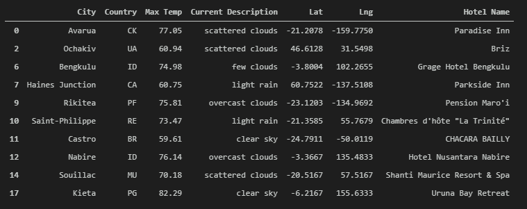
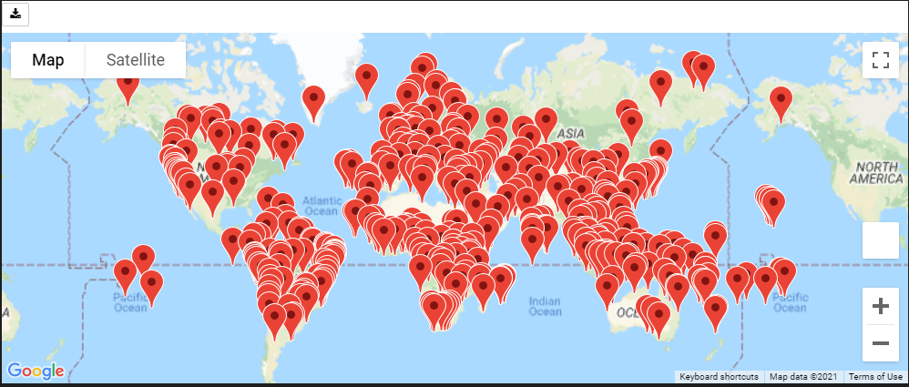
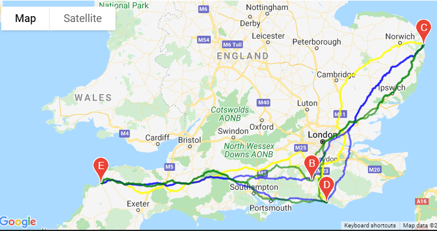
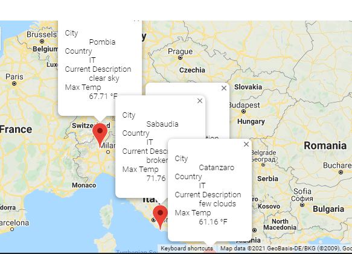

# Google Maps and Travel Analysis

## Project Overview

 Create a number of random locations in the world and used an API to find the closest city within the closest proximity to each location.

- Deliverables:
  1. 
  2. 
  3. 

## Resources
- Data Source: city_data.csv, ride_data.csv
- Software: Python 3.7.10, Visual Studio Code 1.56.2, Jupyter Notebook Server 6.3.0

## Results

### Analysis of Deliverable 1

### Analysis of Deliverable 2

 

### Analysis of Deliverable 3

## Overall Summary

