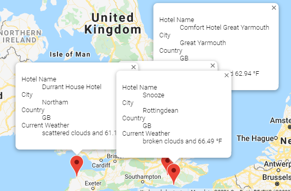

# Planning My Trip with Google Maps

## Project Overview

To design a "PlanMyTrip" application that allows users to filter destinations based on temperature preferences. Once a temperature range has been selected by a client, this is used to identify potential destinations of travel and nearby accomodation choices. From the destination list, the client will choose a city to travel to along with a four-city travel itinerary. With the use of different Application Programming Interfaces(APIs) a marker map showing the four cities will be created along with a travel route map showing three different methods of transportation  - driving(green), bicycling(blue) and walking(green). Each transportation method is colour coded, as above, for ease of view on the itinerary map.

- Deliverables:
  1. Connect using OpenWeatherMap, retrieve weather data and export the results in a CSV file.
  2. Create a client travel map with various destinations and nearby hotels using Google Maps. 
  3. Create a four-city travel itinerary and associated marker map with Google Maps.

## Resources
- Current Weather Data: Open Weather API
- Google Maps REST APIs: Places API, Directions API, Javascript API
- Data files created from above APIs: WeatherPy_Database.csv, WeatherPy_vacation.csv
- Software: Python 3.7.10, Visual Studio Code 1.56.2, Jupyter Notebook Server 6.3.0

## Results

### Analysis of Deliverable 1

Current weather data is extracted using the Openweather API and attached to a number of cities in our database. The information is formatted correctly and saved as shown in the dataframe below.

### Analysis of Deliverable 2

 The client is able to enter 2 values into a input request that allows a minimum and maximum temperature rannge to be determined. The system then goes out and searches all destinations currently in the database that have a current acceptable temperature that suits the client's needs. The following is a sample list of destinations with a minimum value of 55 degrees and a maximum of 85 degrees F.

The total destination cities world wide are then mapped to a google map and displayed for the client to review.

### Analysis of Deliverable 3

Once the client has chosen a specific destination, the system will ask about a four-city itenary for travelling locally. The information is entered by the client into an input request window with starting location, 1st city, 2nd city, 3rd city that the client wants to visit. The following is an example of the dataframe produced and the google map with the completed iternary produced by the software.
 
 

Below is the same map with individual markes assigned to each city stop along the four city itinerary requested by the client.

## Overall Summary

In summary we are able to collect a list of cities, access the OpenWeathe API and extract local weather information